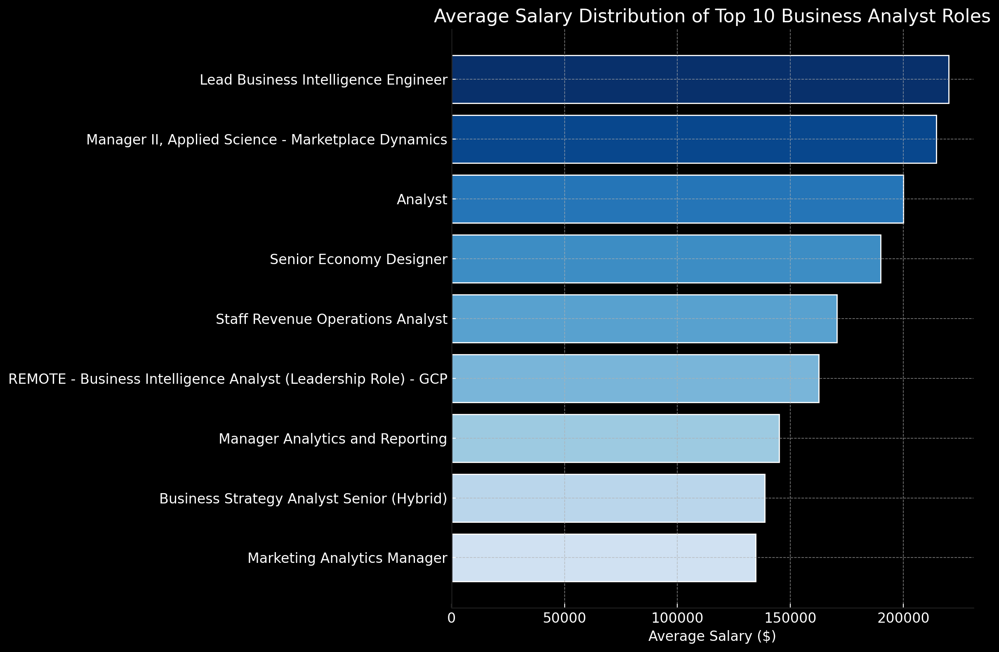
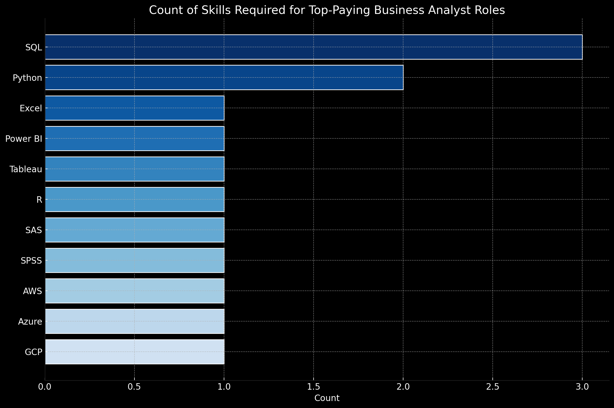

# Introduction
Here is my deep dive into the data job market! Focusing on analyst roles, this project explore top-paying positions, in-demand skills and the intersection point of both, for Business Analyst jobs. 

SQL queries? Check them out here: [project_sql folder](/project_sql/)

# Background
As an undergraduate in NUS majoring in Business Analytics, I embarked on this project in order to pinpoint top-paid and in-demand skills, to find out what was required to secure top-paying Business Analyst roles. 
This ultimately streamlines the process to find optimal jobs.

Data hails from [Luke Barousse's SQL Course](https://www.lukebarousse.com/sql), that includes the job titles, salaries, locatios and essential skills.

 ### The guiding questions I used were:

 1. What are the top-paying business analyst jobs?
 2. What are the skills required for these top-paying jobs?
 3. What skills are most in demand for Business Analysts?
 4. Which skills are associated with higher salaries?
 5. What are the most optimal skills to learn?

# Tools I Used
To analyse and dive deep into the data job market, I harnessed the power of several key tools:

- **SQL:** using SQL as the backbone of my analysis, I queried from the database and unearthed critical insights.
- **PostgreSQL:** The chosen databse management system, ideal for handling job posting data.
- **Visual Code Studio:** Go-to databse for management and excuting SQL Queries

# The Analysis
Each query for this project aimed at investigating specific aspects of the data job market. Here's how I approached each question

### 1. Top paying Business Analyst Jobs
To identify the highest-paying roles, I filtered Businesss Analyst positions by avverage yearly asalry and loaction, focusing on remote jobs. This query highlights the high paying oppotunities in the field.

```sql
SELECT
    job_id,
    job_title,
    job_location,
    job_schedule_type,
    salary_year_avg,
    job_posted_date,
    name as company_name
FROM
    job_postings_fact
LEFT JOIN company_dim on job_postings_fact.company_id = company_dim.company_id
WHERE
    job_title_short = 'Business Analyst' AND
    job_location = 'Anywhere' AND
    salary_year_avg IS NOT NULL
ORDER BY
    salary_year_avg DESC
LIMIT 10;
```

Here's the breakdown of top Business Analyst jobs in 2023

**Top Companies Offering High Salaries:**

- Noom and Uber are leading with high-paying roles, showcasing their investment in top talent for business intelligence and applied science roles.

**High Demand for Analysts:**

- Multicoin Capital frequently posts high-paying analyst roles, indicating a strong demand for analytical skills within the company.

**Remote Work Opportunities:**

- All listed roles are remote, highlighting the growing trend and acceptance of remote work, especially for high-paying, specialized positions in data analysis and business intelligence.


*Bar graph visualising the salary for the top 10 salaries for Business Analysts; ChatGPT generated this graph from my SQL query results*

### 2. Skills for Top Paying Jobs
Joining job posting with the skills data, I can match and extract insights into what employers value for high-compensation rate, to better understand what skills are required for top-paying jobs.

```sql
WITH top_paying_jobs AS (

SELECT
    job_id,
    job_title,
    salary_year_avg,
    name as company_name
FROM
    job_postings_fact
LEFT JOIN company_dim on job_postings_fact.company_id = company_dim.company_id
WHERE
    job_title_short = 'Business Analyst' AND
    job_location = 'Anywhere' AND
    salary_year_avg IS NOT NULL
ORDER BY
    salary_year_avg DESC
LIMIT 10

)

SELECT
    top_paying_jobs.*,
    skills
FROM top_paying_jobs
INNER JOIN skills_job_dim on top_paying_jobs.job_id = skills_job_dim.job_id
INNER JOIN skills_dim on skills_job_dim.skill_id = skills_dim.skill_id
```
Here's a breakdown of the most demanded skills for the top 10 highest paying Business Analyst Jobs:

**Most Frequently Required Skills:**

- **SQL** is the most frequently required skill, appearing 3 times in the job postings. This highlights the importance of SQL for data management and manipulation in high-paying business analyst roles.

**High Demand for Versatile Programming Skills:**

- **Python** is the second most frequently required skill, appearing 2 times. Python's versatility and wide range of libraries make it a crucial tool for data analysis and business intelligence.

**Variety of Specialized Tools and Technologies:**

Several other skills appear once in the job postings, such as **Excel, Power BI, Tableau, R, SAS, SPSS, AWS, Azure, and GCP.** This indicates that high-paying business analyst roles often require proficiency in a variety of specialized tools and technologies. These skills cater to different aspects of data analysis, visualization, and cloud computing, showing a trend towards multi-disciplinary expertise.


*Bar graph visualizing the count of skills for the top 10 paying jobs for Business Analysts; ChatGPT generated this graph from my SQL query results*

### 3. In-demand skills for Business Analysts
This query helped identify the skills most frequently requested in job postings, directing focus to areas with high demand.

```sql
SELECT 
    skills,
    count(skills_job_dim.job_id) as demand_count
FROM job_postings_fact
INNER JOIN skills_job_dim on job_postings_fact.job_id = skills_job_dim.job_id
INNER JOIN skills_dim on skills_job_dim.skill_id = skills_dim.skill_id
WHERE job_title_short = 'Business Analyst' and
    job_location = 'Anywhere'
GROUP BY
    skills
ORDER BY
    demand_count DESC
limit 5
```
Here's a breakdown of the most demanded skills for Business Analysts

**SQL Dominates the Demand:**

**SQL** is the most in-demand skill, with a significant lead, appearing in 1,266 job postings. This highlights SQL's crucial role in database management and data manipulation, making it an essential skill for business analysts.

**Proficiency in Excel is Highly Valued:**

**Excel** follows as the second most in-demand skill, appearing in 983 job postings. Despite the availability of advanced data analysis tools, Excel remains a staple for business analysts due to its versatility and widespread use in data reporting and analysis.

**Data Visualization Tools Are Critical:**

**Tableau and Power BI** are the third and fourth most in-demand skills, with 728 and 555 job postings, respectively. This underscores the importance of data visualization tools in translating complex data into actionable insights. Business analysts who can effectively use these tools are highly valued for their ability to communicate data-driven decisions.

| Skills | Demand Count |
| --- | --- |
| sql | 1266 |
| excel | 983 |
| tableau | 728 |
| power BI | 555 |
| python | 546 |

*Table of the demand for the top 5 skills in Business Analyst jobs*

### 4. Skills based on Salary 
Exploring the average salaries associated with different skills revealed which skills are the highest paying.

```sql
SELECT 
    skills,
    round(avg(salary_year_avg),0) as avg_salary
FROM job_postings_fact
INNER JOIN skills_job_dim on job_postings_fact.job_id = skills_job_dim.job_id
INNER JOIN skills_dim on skills_job_dim.skill_id = skills_dim.skill_id
WHERE job_title_short = 'Business Analyst' and
    job_location = 'Anywhere' AND
    salary_year_avg IS NOT NULL
GROUP BY
    skills
ORDER BY
    avg_salary DESC
limit 25
```

**Configuration Management and DevOps Tools:**

**Chef** stands out as the highest-paying skill with an average salary of $220,000. This indicates a significant demand for expertise in configuration management and DevOps practices among business analysts, reflecting the importance of automation and infrastructure management in data-driven environments.

**Data Visualization and Business Intelligence:**

**Looker** commands a high average salary of $130,400, highlighting the critical role of advanced data visualization and business intelligence tools in transforming raw data into actionable insights.
**Qlik and Tableau** also show competitive salaries, with $110,175 and $104,233, respectively, emphasizing their value in the business analyst toolkit for creating impactful visual reports and dashboards.

**NoSQL and Database Technologies:**

**MongoDB ($120,000), NoSQL ($110,490), and Elasticsearch ($110,000)** are among the top-paying skills, reflecting the increasing reliance on NoSQL databases and search engines for handling large volumes of unstructured data efficiently.


|      skills      |   avg_salary   |
|:-----------------|:--------------:|
| chef             |  220000        |
| phoenix          |  135990        |
| looker           |  130400        |
| mongodb          |  120000        |
| python           |  116516        |
| bigquery         |  115833        |
| gcp              |  115833        |
| r                |  114629        |
| snowflake        |  114500        |
| db2              |  114500        |


*Table of the average salary for the top 10 paying skills for Business Analysts*

### 5. Most Optimal Skills to Learn
Combining insights from demand and salary data, this query aimed to pinpoint skills that are both in high demand and have high salaries, offering a strategic focus for skill development.

```sql
WITH skills_demand AS (
SELECT 
    skills_dim.skill_id,
    skills_dim.skills,
    count(skills_job_dim.job_id) as demand_count
FROM job_postings_fact
INNER JOIN skills_job_dim on job_postings_fact.job_id = skills_job_dim.job_id
INNER JOIN skills_dim on skills_job_dim.skill_id = skills_dim.skill_id
WHERE job_title_short = 'Business Analyst' and
    salary_year_avg IS NOT NULL
GROUP BY
    skills_dim.skill_id
),

avg_salaries as (
SELECT 
    skills_job_dim.skill_id,
    round(avg(salary_year_avg),0) as avg_salary
FROM job_postings_fact
INNER JOIN skills_job_dim on job_postings_fact.job_id = skills_job_dim.job_id
INNER JOIN skills_dim on skills_job_dim.skill_id = skills_dim.skill_id
WHERE job_title_short = 'Business Analyst' and
    salary_year_avg IS NOT NULL
GROUP BY
    skills_job_dim.skill_id
)

select
    skills_demand.skill_id,
    skills_demand.skills,
    demand_count,
    avg_salary
from
    skills_demand
inner join avg_salaries on skills_demand.skill_id = avg_salaries.skill_id
where demand_count > 10
ORDER BY
    avg_salary DESC,
    demand_count DESC
LIMIT 25
```

Here's the breakdown for the most optimal skills for Business Analyst:

**Big Data and Data Management:**

**Hadoop** stands out with an average salary of $139,201 and a demand count of 14, indicating its high value in managing and processing large datasets.
**Phoenix**, with a demand count of 16 and an average salary of $135,248, highlights the importance of specialized databases for handling massive amounts of data efficiently.

**Programming Languages:**

**Python** has the highest demand count of 143 and an average salary of $104,277, reflecting its widespread use and importance in data analysis, machine learning, and general programming.
**R** also shows significant demand with a count of 73 and an average salary of $105,969, indicating its relevance in statistical analysis and data visualization.

**Cloud and Data Platforms:**

**Snowflake** is in high demand with a count of 34 and an average salary of $112,543, highlighting its role as a leading cloud data platform for data warehousing and analytics.
**AWS and Azure** are also notable, with demand counts of 25 and 22, and average salaries of $105,996 and $103,836, respectively. This underscores the growing reliance on cloud services for scalable data solutions.

**Business Intelligence and Visualization:**

**Tableau** shows a significant demand count of 212 with an average salary of $98,794, emphasizing the importance of data visualization in deriving actionable insights.

|   skill_id | skills    |   demand_count |   avg_salary |
|-----------:|:----------|---------------:|-------------:|
|         97 | hadoop    |             14 |       139201 |
|        137 | phoenix   |             16 |       135248 |
|          2 | nosql     |             11 |       119330 |
|         80 | snowflake |             34 |       112543 |
|        185 | looker    |             25 |       110581 |
|         76 | aws       |             25 |       105996 |
|          5 | r         |             73 |       105969 |
|          8 | go        |             33 |       105701 |
|          1 | python    |            143 |       104277 |
|         74 | azure     |             22 |       103836 |


*Table of top 10 optimal skills for Business Analysts based on results of my query*

### 
# What I Learned
Through this project, I managed to expand my knowledge of data mining and generating insights, adding my firepower to my SQL toolkit:

- **Crafting of Complex Queries:** Moving past basic querying, I utilised different ```JOIN & UNION``` statements to merge tables as well as incoprating ```WITH``` clauses to create temp tables crucial to match values and extract insights.

- **Data Aggregation:** Got familiar with ```GROUP BY``` and aggregate functions like ```COUNT() AND AVG()``` to better summarise data.

- **Analytics-to-Insights:** Exposed myself to real-world puzzle-solving skills, turning questions into actionabel, insightful SQL quesries.

# Conclusion

### Insights

To conclude this project, here are the key findings of this project:

- **Top Paying Business Analyst Jobs:** The highest-paying jobs for Business Analyst that allow for remote work offer handsome compensation, with the highest being $220000!

- **Skills for Top-Paying Jobs:** High-Paying Business Analyst roles require skills such SQL & Python, suggesting that the mastery of these popular programming languages is critical for earning a high salary. 

- **Most In-Demand Skills:** SQL is the most in-demand skill for Business Analysts, making it an essential skill for job seekers.

- **Skills with Higher Salaries:** Specialised skills like PySpark for Big Data processign, BitBucket for code hosting and version control and CouchBase for NOSQL database management are associated with high salaries, indicated a premium on niche expertise.

- **Optimal skills for Job Market Value:** SQL leads in demand and offers for a high average salary, positioning it as one of the most optimal skills for data analysts to learn to maximize their market value.

### Closing Thoughts

This project enhanced my SQL skills and provided valuable insights into the data analyst job market. The findings from the analysis help to identify to main focus points for jobseekers looking to secure a high-paying Business Analyst role(such as myself), by focusing on high-demand and high-salary skills. This project also highlights to importance of mastering the meat and potatoes of analytic tools and the potential for payoff for nicheing down, stressing that continuous leanring and adaptation to emerging trends is crucial to stay competitive in today's job market
